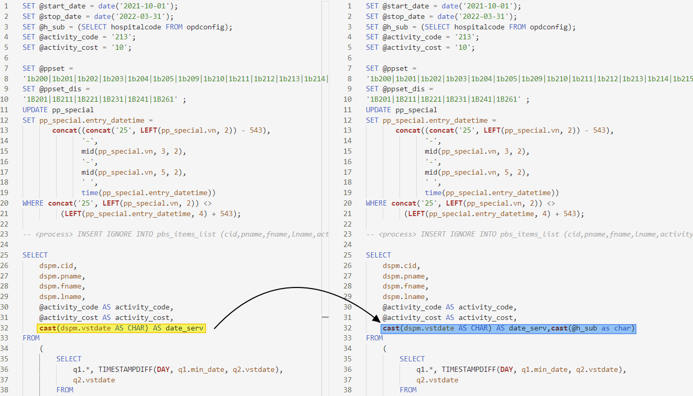
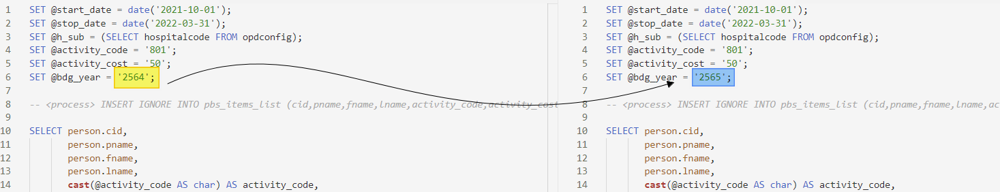

## 2022-04-24 11:20 [301]

แจ้งปรับปรุง คำสั่ง SQL 
**รหัส 301 การตรวจสุขภาพเด็กนักเรียนประถม/มัธยม**
เพื่อให้สามารถประมวลผล ไตรมาส ที่ 4,1 ของปีได้
บรรทัดที่ 30 จาก "`BETWEEN 4 AND 1`" เปลี่ยนเป็น "`IN (4,1)`"
ดังรูปภาพประกอบ

## 2022-04-25 15:00 [213]

แจ้งปรับปรุง คำสั่ง SQL PP Basic Service 2565
**รหัส 213 Follow DSPM ประเมินพัฒนาการเด็ก 0 - 5 ปี สงสัยล่าช้า  (9,18,30,42,60 เดือน)**
เพื่อให้สามารถประมวลผล ได้ถูกต้อง ครบถ้วน
บรรทัดที่ 32 จาก "`cast(dspm.vstdate AS CHAR) AS date_serv`" เปลี่ยนเป็น "`cast(dspm.vstdate AS CHAR) AS date_serv,cast(@h_sub as char) as h_sub`"
ดังรูปภาพประกอบ

## 2022-04-26 18:54 [801]

แจ้งปรับปรุง คำสั่ง SQL 
**Confirm screening การคัดกรองความเสี่ยงต่อการเกิดโรค Metabolic,DM ,HTอายุ 35 ปีขึ้นไป**
เพื่อให้สามารถประมวลผล ถูกต้องตามปีงบประมาณได้
บรรทัดที่ 6 จาก "`2564`" เปลี่ยนเป็น "`2565`"
ดังรูปภาพประกอบ

