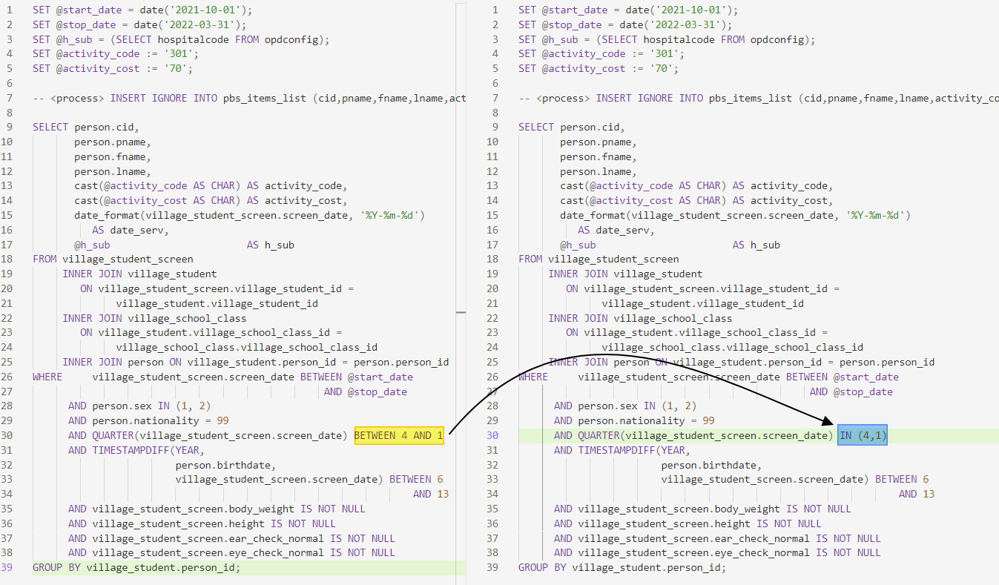

## 2022-04-29 14:01 [701,702,804]

แจ้งปรับปรุง คำสั่ง SQL 

#### **701 คัดกรองผู้สูงอายุ 60 ปี ขึ้นไป**

เพื่อให้สามารถประมวลผล คัดกรองก่อนเสียชีวิตได้
บรรทัดที่ 482 - 483 จาก 

```sql
AND person.death <> 'y'
AND person.discharge_date IS NULL
```

เป็น

```sql
AND (person.death <> 'y'
AND person.discharge_date IS NULL) OR (person.death = 'y' and person.discharge_date > ovst.vstdate )
```

ดังรูปภาพประกอบ


------

แจ้งปรับปรุง คำสั่ง SQL 

#### **702 ประเมินกิจวัตรประจำวัน ADL ตามคู่มือ 12 รายการ**

เพื่อให้สามารถประมวลผล คัดกรองก่อนเสียชีวิตได้
บรรทัดที่ 42-43 จาก

```sql
AND (   (person.death <> 'y' AND person.discharge_date IS NULL)
           OR person.death_date < ovst.vstdate)
```

เป็น

```sql
AND (   (person.death <> 'y' AND person.discharge_date IS NULL)
           OR (person.death =  'y' AND person.death_date > ovst.vstdate) )
```

ดังรูปภาพประกอบ

 

------

แจ้งปรับปรุง คำสั่ง SQL 

#### **804 คัดกรองภาวะซึมเศร้า 2Q**

เพื่อให้สามารถประมวลผล คัดกรองก่อนเสียชีวิตได้
บรรทัดที่ 24 - 30 จาก 

```sql
AND person.death <> 'y'
AND person.discharge_date IS NULL
AND person.house_regist_type_id IN (1, 3)
AND (   depression_screen.feel_boring_2_week IN ('y', 'n')
           OR depression_screen.feel_depression_2_week IN ('y', 'n')
           OR depression_screen.no_depression IN ('y', 'n'))
      AND person.death_date IS NULL
```

เป็น

```sql
AND ((person.death <> 'y'
AND person.discharge_date IS NULL) OR (person.death = 'y' AND person.discharge_date > ovstdiag.vstdate))
AND person.house_regist_type_id IN (1, 3)
AND (   depression_screen.feel_boring_2_week IN ('y', 'n')
           OR depression_screen.feel_depression_2_week IN ('y', 'n')
           OR depression_screen.no_depression IN ('y', 'n'))
```

ดังรูปภาพประกอบ


------

## 2022-04-26 18:54 [801]

แจ้งปรับปรุง คำสั่ง SQL 

#### **801 Confirm screening การคัดกรองความเสี่ยงต่อการเกิดโรค Metabolic,DM ,HTอายุ 35 ปีขึ้นไป**

เพื่อให้สามารถประมวลผล ถูกต้องตามปีงบประมาณได้
บรรทัดที่ 6 จาก "`2564`" เปลี่ยนเป็น "`2565`"
ดังรูปภาพประกอบ


------

## 2022-04-25 15:00 [213]

แจ้งปรับปรุง คำสั่ง SQL PP Basic Service 2565

#### **รหัส 213 Follow DSPM ประเมินพัฒนาการเด็ก 0 - 5 ปี สงสัยล่าช้า  (9,18,30,42,60 เดือน)**

เพื่อให้สามารถประมวลผล ได้ถูกต้อง ครบถ้วน
บรรทัดที่ 32 จาก "`cast(dspm.vstdate AS CHAR) AS date_serv`" เปลี่ยนเป็น "`cast(dspm.vstdate AS CHAR) AS date_serv,cast(@h_sub as char) as h_sub`"
ดังรูปภาพประกอบ


------

## 2022-04-24 11:20 [301]

แจ้งปรับปรุง คำสั่ง SQL 

#### **รหัส 301 การตรวจสุขภาพเด็กนักเรียนประถม/มัธยม**

เพื่อให้สามารถประมวลผล ไตรมาส ที่ 4,1 ของปีได้
บรรทัดที่ 30 จาก "`BETWEEN 4 AND 1`" เปลี่ยนเป็น "`IN (4,1)`"
ดังรูปภาพประกอบ


